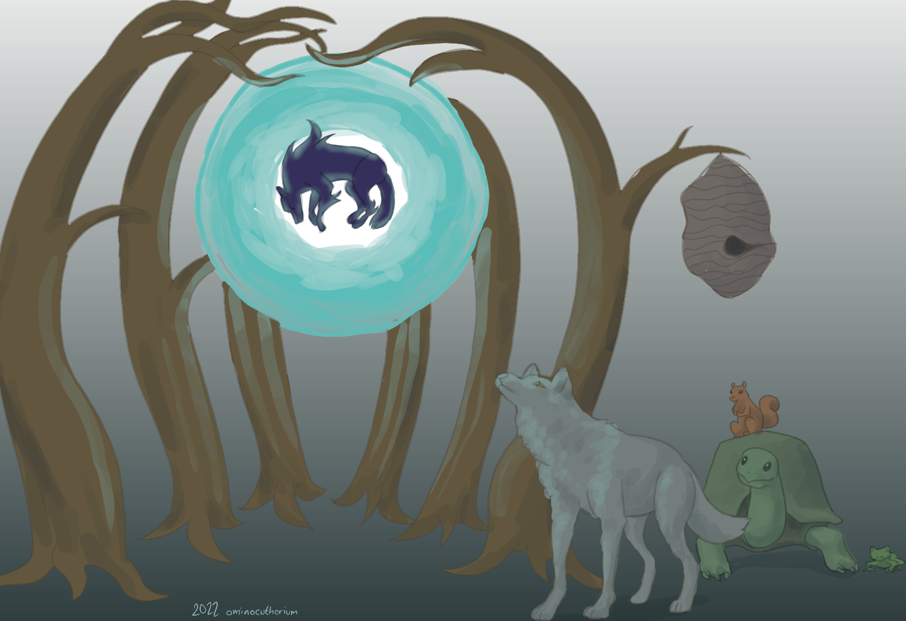

# Unnamed RTS Project

In [name of game], the animals of the forest, large and small, unite to fend off a ghastly evil force that invades and corrupts flora and fauna. Gather Forest Hearts to build facilities to purify the area, capture enemy units, and bring them to your side once they are purified. Power up your units with resources, then take the offensive over to the enemy contaminated base and restore balance to nature.

Made with Godot 3.5 for RTSJam on itchio, running from June 24th-July 28th. Documentation including game design and roadmap specifics are added to `/doc` prior to the start of the jam period. Game code goes to `game/` once the jam starts. Assets are not included in this repository due to possibly incompatible licensing.

